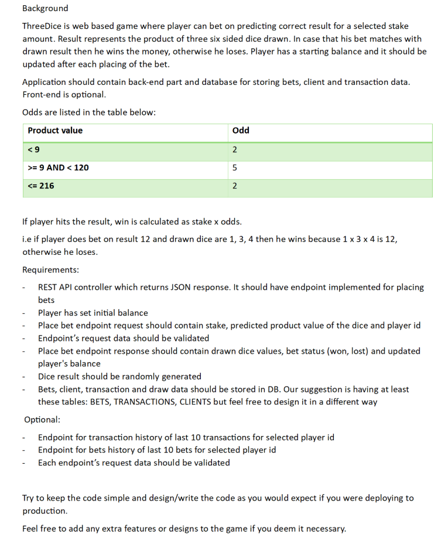
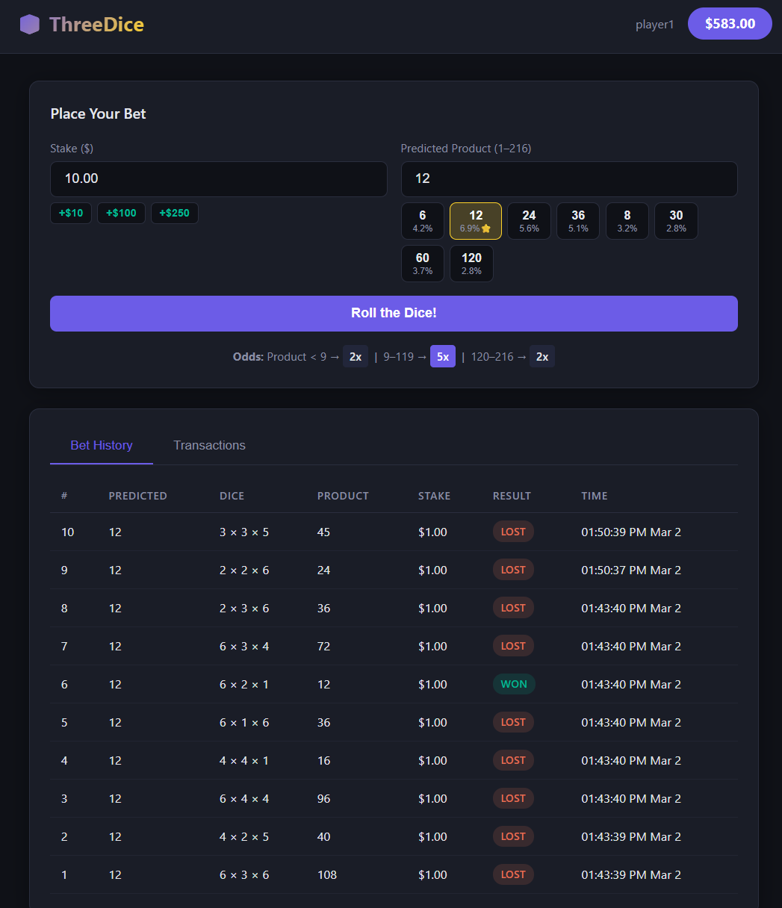

# ThreeDice

#### Input requirements:


#### App screenshot:


A web-based dice betting game, implemented **twice** — once in Spring Boot and once in Go — against the same
requirements, the same business logic, the same REST contract and the same frontend.

Players bet on predicting the product of three six-sided dice. If the prediction matches the rolled product, the
player wins their stake multiplied by the applicable odds.

## The two implementations

| | [`spring-boot/`](spring-boot/) | [`go/`](go/) |
|---|---|---|
| Language | Java 21 | Go 1.26 |
| HTTP | Spring MVC | chi + net/http |
| Persistence | Spring Data JPA / Hibernate | sqlc over pgx |
| Money | `BigDecimal` | shopspring/decimal |
| Validation | Jakarta Bean Validation | go-playground/validator |
| Migrations | Flyway | golang-migrate |
| Logging | SLF4J / Logback | log/slog |
| Errors | `ProblemDetail` (RFC 7807) | hand-rolled RFC 7807 |
| Tests | Testcontainers + REST Assured | testcontainers-go + testify |
| Frontend | served from `resources/static` | same files, embedded via `embed.FS` |
| Database | `threedice` | `threedice_go` |
| Port | 8080 | 8081 |

Both own their schema independently, so either can be run on its own against an empty database.

See [`spring-boot/README.md`](spring-boot/README.md) and [`go/README.md`](go/README.md) for building, running and
deploying each one.

## Quick start

```bash
docker compose up --build
```

That starts PostgreSQL 16 (creating both databases), then builds and runs both services:

- Spring Boot → [http://localhost:8080](http://localhost:8080)
- Go → [http://localhost:8081](http://localhost:8081)

Each seeds its own demo player (`id=1`, balance `1000.00`) on first startup and serves the frontend at `/`.

> **Existing volume?** The `threedice_go` database is created by `docker/init-db.sh`, which PostgreSQL only runs
> when the data volume is first initialised. If you already have a `pgdata` volume from an earlier version, either
> `docker compose down -v` (destroys data) or create it by hand:
> ```bash
> docker compose exec postgres psql -U threedice -d threedice -c 'CREATE DATABASE threedice_go OWNER threedice;'
> ```

To run just the database and start a service yourself, `docker compose up -d postgres`.

## Odds Table

| Product Value | Odds |
|---------------|------|
| < 9           | 2x   |
| 9 – 119       | 5x   |
| 120 – 216     | 2x   |

> **Note:** The current odds table heavily favours the house. Since the player must predict the **exact** product of three dice, individual product probabilities are very low (typically 1–7%), yet the maximum payout is only 5x. This results in a large house edge across all ranges - for example, the most common product (e.g. 12 or 24) appears in ~7% of rolls, meaning a fair payout would be around 14x rather than 5x.

### Proposed Fair Odds Table

A more balanced alternative with finer-grained ranges, accounting for actual product probabilities. With 216 total outcomes (6^3), products in the mid-low range (e.g. 12, 24, 30) have the most dice combinations, while extreme values are much rarer.

| Product Value | Proposed Odds | Rationale                                                                 |
|---------------|---------------|---------------------------------------------------------------------------|
| 1 – 8         | 35x           | Only 7 possible products, most with very few combinations (1–9 ways)     |
| 9 – 50        | 12x           | Most populated range - products like 12, 24, 30 each have 12–15 ways    |
| 51 – 120      | 25x           | Fewer combinations per product; values like 60, 72, 120 have 6–9 ways   |
| 121 – 216     | 50x           | Very rare - only 4 products exist (125, 144, 150, 180, 216) with 1–3 ways each |

These multipliers include a ~5–10% house edge over mathematically fair payouts.

## API Reference

Both services expose exactly this contract.

### Place a Bet

```
POST /api/bets
Content-Type: application/json

{
    "playerId": 1,
    "stake": 10.00,
    "predictedValue": 12,
    "idempotencyKey": "b1f3c8e2-..."
}
```

**Response** (201 Created):
```json
{
    "betId": 1,
    "dieOne": 1,
    "dieTwo": 3,
    "dieThree": 4,
    "productValue": 12,
    "status": "WON",
    "winnings": 50.00,
    "balanceAfter": 1040.00
}
```

### Get Player Info

```
GET /api/players/{playerId}
```

**Response** (200 OK):
```json
{
    "id": 1,
    "username": "player1",
    "balance": 1000.00,
    "createdAt": "2026-03-02T09:00:00Z"
}
```

### Bet History (Last 10)

```
GET /api/bets/history/{playerId}
```

**Response** (200 OK):
```json
[
    {
        "betId": 1,
        "predictedValue": 12,
        "stake": 10.00,
        "status": "WON",
        "dieOne": 1,
        "dieTwo": 3,
        "dieThree": 4,
        "productValue": 12,
        "createdAt": "2026-03-02T09:01:00Z"
    }
]
```

### Transaction History (Last 10)

```
GET /api/transactions/history/{playerId}
```

**Response** (200 OK):
```json
[
    {
        "transactionId": 1,
        "betId": 1,
        "type": "CREDIT",
        "amount": 50.00,
        "balanceAfter": 1040.00,
        "createdAt": "2026-03-02T09:01:00Z"
    }
]
```

### Errors

Both services return RFC 7807 `application/problem+json`:

```json
{
    "type": "about:blank",
    "title": "Not Found",
    "status": 404,
    "detail": "Player not found with ID: 99999",
    "instance": "/api/players/99999"
}
```

| Status | When |
|--------|------|
| 400 | Validation failure, insufficient balance, unparseable body or path variable |
| 404 | Unknown player or unmapped route |
| 405 | Known route, wrong verb |
| 409 | Duplicate `idempotencyKey` |

## Features

- **Idempotent Bet Placement**: Each bet request carries a unique idempotency key. Duplicate submissions are detected and rejected with a `409 Conflict`, preventing accidental double-charges.

- **Input Validation**: Stake must be between $1 and $10,000, and the predicted value must be a mathematically possible product of three dice (only 40 out of 216 values are valid). Invalid requests return a `400 Bad Request` with a descriptive error message.

- **Pessimistic Locking on Balance**: Player balance reads use `SELECT ... FOR UPDATE` to prevent concurrent bets from reading stale balances. This ensures correctness under concurrent load.

- **Transactional Integrity**: Each bet placement (stake deduction, dice roll, outcome resolution, balance update, and transaction recording) executes within a single database transaction.

- **Quick Pick & Quick Stake Buttons**: The frontend provides popular predicted values (with win probabilities) and stake increment buttons for faster gameplay without manual input.

- **Secure Dice Rolling**: Dice are rolled from a cryptographically secure source (`java.security.SecureRandom` / `crypto/rand`), ensuring unpredictable outcomes.

- **Transaction Audit Trail**: Every bet generates a corresponding ledger entry (DEBIT on loss, CREDIT on win) with a `balanceAfter` snapshot, exposed via a dedicated history endpoint.

- **Database-Level Constraints**: PostgreSQL CHECK constraints enforce die values (1–6), bet status (WON/LOST), and transaction type (DEBIT/CREDIT) as a defense-in-depth layer beyond application validation.

- **Integration Tests with Deterministic Dice**: Both suites inject a scripted dice source to control outcomes deterministically, running against a real PostgreSQL via Testcontainers. 29 tests each, case for case.

## Known differences between the two services

The APIs were diffed response-by-response; 22 of 23 error and validation cases are byte-identical. The
remainder are deliberate:

- **Money always renders at 2dp in Go.** `BigDecimal` carries the scale of whatever it was built from, so Java
  answers a `"stake": 10` request with `"winnings": 50` but a `"stake": 10.00` request with `"winnings": 50.00`,
  and a loss with `"winnings": 0`. Go always emits `50.00` / `0.00`. Every value read from the database is 2dp in
  both. The same applies inside the insufficient-balance message.
- **`createdAt` within a single bet.** Java stamps each entity with `Instant.now()`, so a bet and its transaction
  differ by a few hundred microseconds. Go lets PostgreSQL default the column, and `now()` is the transaction
  timestamp, so both rows share one value. Ordering across bets is unaffected.

## Further improvements that could be delivered in future iterations

- Bet and transaction history to return paginated results, not only last 10 entries.
- Add filter capabilities in bet and transaction history.
- Add cache layer for hot data.
- Add sign up / login flows and authenticate bets with JWT through spring security.
- Add some animations and assets (eg rolling dice) on the client side and improve UX.
- The frontend is duplicated in both services; a shared build step would stop the two copies drifting apart.
